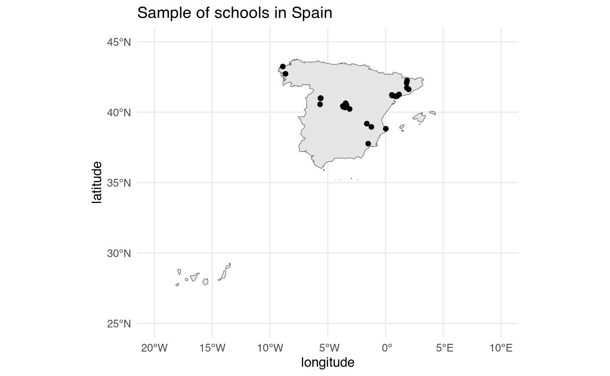
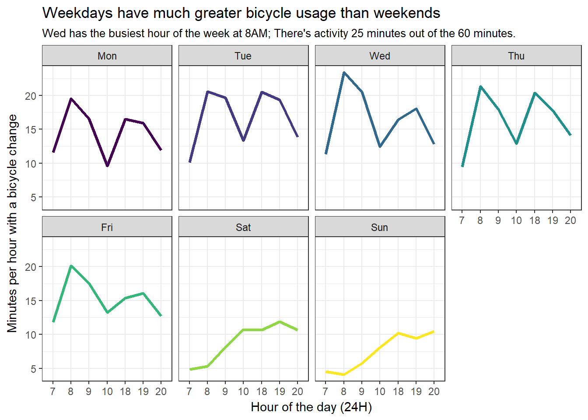

## Welcome to the world of Data Harvesting

- Jorge Cimentada

- Chief Data Scientist at Cognitiva Labs

- PhD in Sociology

How about you?

## What can you expect from the course?

We'll learn how to scrape data from the web.

{fig-align="center"}

## What can you expect from the course?

We'll learn how to interact with APIs.

{fig-align="center"}

## Course website and materials

<https://tlouf.github.io/dataharvesting/>{.r-fit-text}

## How will this course work?

- Office hours on Tuesdays between 18:00 and 20:00. **Requests must be sent by email and confirmed in advance. Office hours will be held online via video call.**
- Email: **tlouf\@math.uc3m.es**
- Classes on Thursdays:
    - 18:00 – 19:30: First session
    - 19:30 – 19:45: Break (15 mins)
    - 19:45 – 20:45: Second session

## How will this course work?

- Readings and exercises will be assigned for each upcoming class.

- Review the assigned material beforehand: read the content and run the code.

 

Grading:

- Class participation: 20%

- Final project: 80%

## Course outline

- Web scraping -- First three classes (**30th Jan / 6th Feb / 13th Feb**)

- APIs -- Next three classes (**20th Feb / 27th Feb / 6th March**)

- Automating Data Harvesting (Final class, REMOTE CLASS) -- **13th March**

- Final project presentations -- **27th March / 16:30–19:15**

## Final project

The final project spreadsheet is available [here](https://docs.google.com/spreadsheets/d/11QmdgRXvbwtN9hSOwVyw9-iVjrN-yeRq_BOudidAnX8/edit#gid=73208201).

- Find your partner as soon as possible -- **deadline: 14th February (third class)**

- Submit project ideas -- **deadline: 27th February (fifth class)**

- Submit final project -- **deadline: 13th March (seventh class)**

- Final project presentations -- **27th March / 16:30–19:15**

- Each team will have 10 minutes to present.

## Project expectations

- Deliverable: A private or public GitHub repository.

- A clear `README` explaining how to reproduce the scraper/API pipeline.

- Reproducibility is key: I should be able to clone the repository and run everything needed to execute the project seamlessly.

- Document what data is collected, where it is saved, and the purpose of each script.

## Project expectations

- Projects should be of intermediate complexity:

    - Scrape multiple sources of information

    - Combine multiple pages or different websites

    - Produce a meaningful dataset (e.g., something useful for another course or research project)

    - **Remember that most of the grade is based on this project.**

- API projects: API keys and tokens must NOT be pushed to your repository. Provide clear instructions on where and how to configure them for reproducibility.

## Project expectations

 

Project ideas must be discussed with and approved by me before the deadline.

 

Feel free to reach out via email at tlouf\@math.uc3m.es.

Examples from previous cohorts:

- <https://github.com/myanesp/media-streaming-tmdb>
- <https://github.com/myanesp/tmdbR>

## Contribute

Contribute to the book!

### <https://tlouf.github.io/dataharvesting>

## Motivation

Motivation: [https://www.coverage-db.org/](https://www.coverage-db.org/)

 

Cautionary tale: [https://www.vox.com/2016/5/12/11666116/70000-okcupid-users-data-release](https://www.vox.com/2016/5/12/11666116/70000-okcupid-users-data-release)
