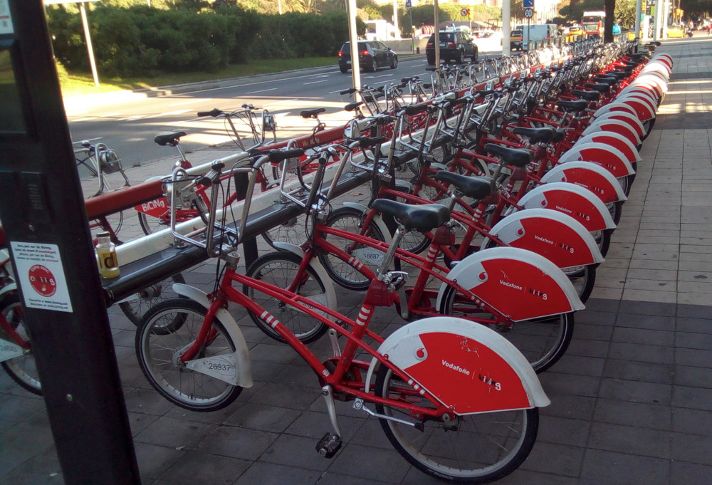
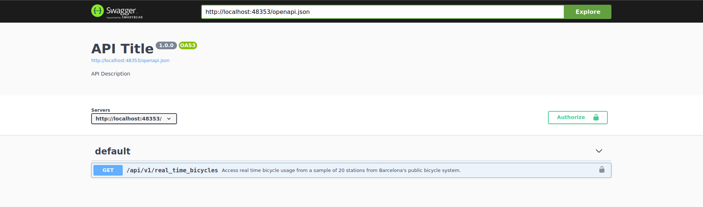
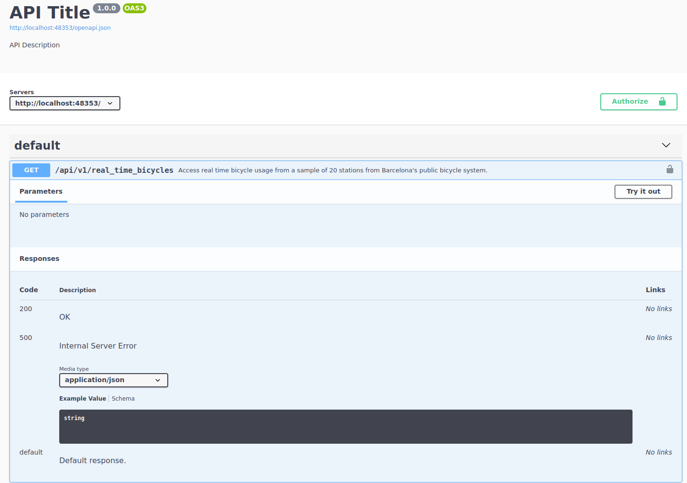
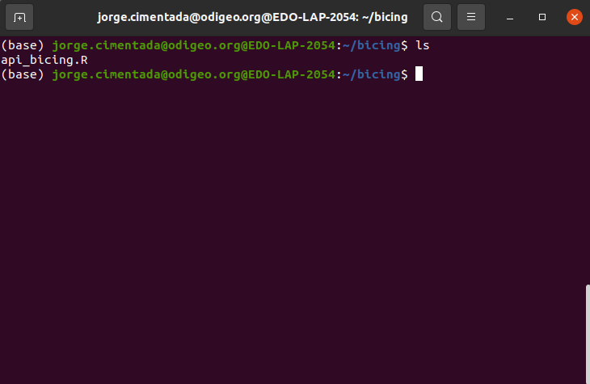
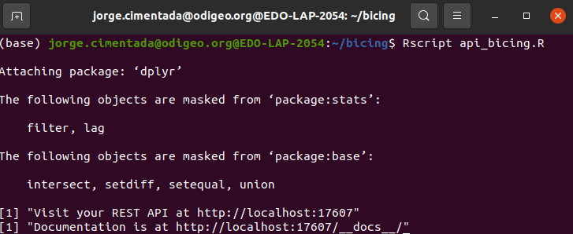
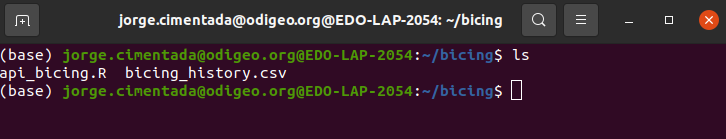
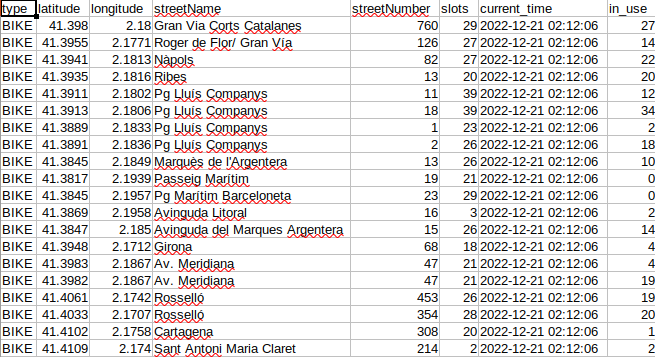
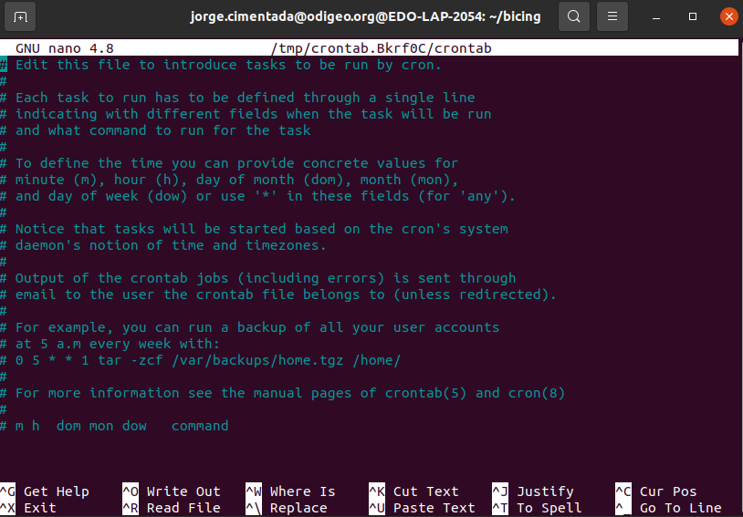
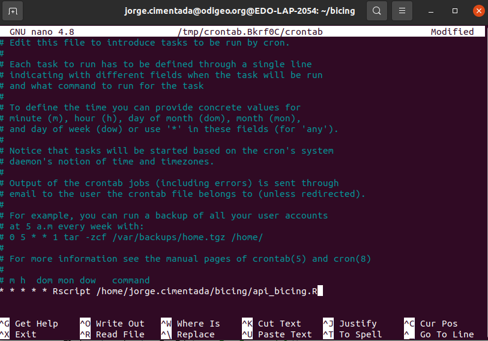
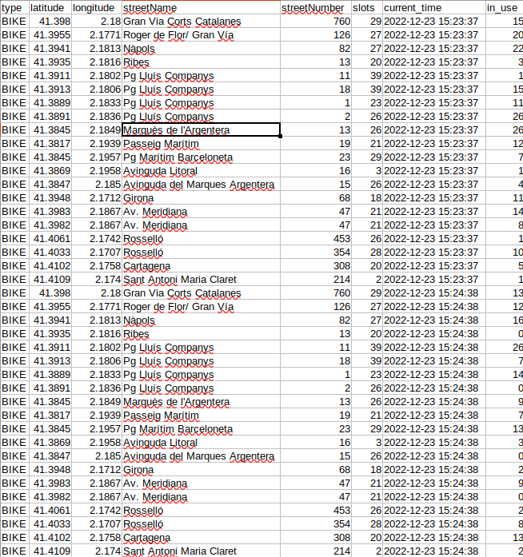

```{r, echo = FALSE}
knitr::opts_chunk$set(
  eval = TRUE,
  echo = TRUE,
  message = FALSE,
  warning = FALSE,
  fig.align = "center",
  fig.asp = 0.618
)
```

## Automating APIs

Ever wondered how you can grab real time data, **on demand**, without moving a finger?

{fig-align="center"}

**Welcome to the world of automation!**

## Automating APIs

- Automating APIs is actually not that special

- It is the same type of work for automating any script: web scraping, APIs, bots

- Here we focus on a real example as a way to motivate automation

- Grabbing real time data from a real-looking API

## Automating APIs



## The Bicing API

- `scrapex` has a near-real copy of the Bicing API. Access it with:

```{r}
library(scrapex)
library(httr2)
library(dplyr)
library(readr)
library(here)

bicing <- api_bicing()
```

## The Bicing API

The first thing we want to check is the documentation:

{fig-align="center"}

## The Bicing API

We want to check the single endpoint:

{fig-align="center"}

## The Bicing API

- Access real time bicycle usage from a sample of 20 stations from Barcelona's public bicycle system

- No parameters needed

- I've only included 20 stations from the original results

- Data changes per request

- If we want to understand bicycle patterns, we need to automate this process and we need to save this data somewhere.

## Talking to the bicing API

- Since no parameters are needed, we go make a request to the endpoint:

```{r, message = TRUE}
rt_bicing <- paste0(bicing$api_web, "/api/v1/real_time_bicycles")

resp_output <- rt_bicing %>%
  request() %>%
  req_perform()

resp_output
```

## Talking to the Bicing API

- Output is JSON

- Status code is 200

- Small data (1 byte = 0.000001 mb)

```{r}
sample_output <-
  resp_output %>%
  resp_body_json() %>%
  head(n = 2)
```

## Talking to the Bicing API

```{r}
sample_output
```

## Talking to the Bicing API

- Output looks like each slot is the row of a data frame where each contains a column, with names like `slots`, `in_use`, `latitude/longitude` and `streetName`

- Loop over each slot and simply try to convert it to a data frame

- Each slot has a named list inside, `data.frame` can convert that directly to a data frame

- Bind all those rows into a single data frame

## Talking to the Bicing API

```{r}
sample_output %>%
  lapply(data.frame) %>%
  bind_rows()
```

<br>

Works well 👏!

## Talking to the Bicing API

Let's scale it to entire response:

```{r}
all_stations <-
  resp_output %>%
  resp_body_json()

all_stations_df <-
  all_stations %>%
  lapply(data.frame) %>%
  bind_rows()

all_stations_df
```

## Talking to the Bicing API

Our strategy should also be to wrap everything in a function:

```{r}
real_time_bicing <- function(bicing_api) {
  rt_bicing <- paste0(bicing_api$api_web, "/api/v1/real_time_bicycles")

  resp_output <-
    rt_bicing %>%
    request() %>%
    req_perform()

  all_stations <-
  resp_output %>%
  resp_body_json()

  all_stations_df <-
    all_stations %>%
    lapply(data.frame) %>%
    bind_rows()

  all_stations_df
}
```

## Talking to the Bicing API

- Receives the bicing API object that has the API website

- Makes a request to the API

- Combines all results into a data frame and returns the data frame.

- Using this example function we can confirm that making two requests will return different data in terms of bicycle usage.

## Talking to the Bicing API

```{r}
first <- real_time_bicing(bicing) %>% select(in_use) %>% rename(first_in_use = in_use)
second <- real_time_bicing(bicing) %>% select(in_use) %>% rename(second_in_use = in_use)
bind_cols(first, second)
```

## Saving data in API programs

For saving data we need to focus on several things:

- We must perform the request to the bicing API

- We must specify a local path where the CSV file will be saved. If the directory of the CSV file has not been created, we should create it.

- If the CSV file does not exist, then we should create it from scratch

- If the CSV file *exists*, then we want to append the result


## Saving data in API programs

```{r}
save_bicing_data <- function(bicing_api) {
  # Perform a request to the bicing API and get the data frame back
  bicing_results <- real_time_bicing(bicing_api)

  # Specify the local path where the file will be saved: in the `data` directory
  # located "here", which is in the directory of this script
  local_csv <- here("data", "bicing_history.csv")

  # Extract the directory where the local file is saved
  main_dir <- dirname(local_csv)

  # If the directory does *not* exist, create it, recursively creating each folder
  if (!dir.exists(main_dir)) {
    dir.create(main_dir, recursive = TRUE)
  }

  # If the file does not exist, save the current bicing response
  if (!file.exists(local_csv)) {
    write_csv(bicing_results, local_csv)
  } else {
    # If the file does exist, the *append* the result to the already existing CSV file
    write_csv(bicing_results, local_csv, append = TRUE)
  }
}
```

## Saving data in API programs

One way to test whether this works is to run this twice and read the results back to a data frame to check that the data frame is correctly structured:

```{r, eval = FALSE}
save_bicing_data(bicing)
Sys.sleep(5)
save_bicing_data(bicing)

bicing_history <- read_csv(here("data", "bicing_history.csv"))
bicing_history %>%
  distinct(current_time)
```

    ## # A tibble: 2 × 1
    ##   current_time
    ##   <dttm>
    ## 1 2022-12-20 23:51:56
    ## 2 2022-12-20 23:52:04

## Saving data in API programs

In addition, we should also have two different numbers in the column `in_use` for the number of bicycles under usage. Let's pick one station to check that it works:

```{r, eval = FALSE}
bicing_history %>%
  filter(streetName == "Ribes") %>%
  select(current_time, streetName, in_use)
```

    ## # A tibble: 2 × 3
    ##   current_time        streetName in_use
    ##   <dttm>              <chr>       <dbl>
    ## 1 2022-12-20 23:51:56 Ribes          13
    ## 2 2022-12-20 23:52:04 Ribes          19

## Automating the program

Here's when the fun part begins.

1.  We create a script that defines the functions we'll use for the program.
2.  Run the functions at the end of that script.
3.  Automate the process using `cron` by running the script on a schedule.

## Automating the program

Here's what we have:

```{r, eval = FALSE}
library(scrapex)
library(httr2)
library(dplyr)
library(readr)

bicing <- api_bicing()

real_time_bicing <- function(bicing_api) {
  rt_bicing <- paste0(bicing_api$api_web, "/api/v1/real_time_bicycles")

  resp_output <-
    rt_bicing %>%
    request() %>%
    req_perform()

  all_stations <-
  resp_output %>%
  resp_body_json()

  all_stations_df <-
    all_stations %>%
    lapply(data.frame) %>%
    bind_rows()

  all_stations_df
}

save_bicing_data <- function(bicing_api) {
  # Perform a request to the bicing API and get the data frame back
  bicing_results <- real_time_bicing(bicing_api)

  # Specify the local path where the file will be saved: in the `data` directory
  # located "here", which is in the directory of this script
  local_csv <- here("data", "bicing_history.csv")

  # Extract the directory where the local file is saved
  main_dir <- dirname(local_csv)

  # If the directory does *not* exist, create it, recursively creating each folder
  if (!dir.exists(main_dir)) {
    dir.create(main_dir, recursive = TRUE)
  }

  # If the file does not exist, save the current bicing response
  if (!file.exists(local_csv)) {
    write_csv(bicing_results, local_csv)
  } else {
    # If the file does exist, the *append* the result to the already existing CSV file
    write_csv(bicing_results, local_csv, append = TRUE)
  }
}

save_bicing_data(bicing)
```

## Automating the program

- Save that script in a newly created folder. I did that in `~/bicing/`

{fig-align="center"}

## Automating the program

- Test it first:

{fig-align="center"}

## Automating the program

If it works:

{fig-align="center"}

## Automating the program

{fig-align="center"}

## Automating the program

Let's set the schedule:

1.  Open cron with `crontab -e`
2.  Define command to run: `* * * * * Rscript <path to api_bicing.R>`
3.  Paste it into the `cron` tab
4.  Exit `cron`
    1.  Hit CTRL and X (this is for exiting the cron interface)

    2.  It will prompt you to save the file. Press Y to save it.

    3.  Press enter to save the cron schedule file with the same name it has.

## Automating the program

{fig-align="center"}

## Automating the program

{fig-align="center"}

## Automating the program

Exit cron and wait a few minutes...⏱️

## Automating the program

{fig-align="center"}

## Summary

- Real time data often needs frequent requests

- `cron` is your friend for that

- Saving data on each request is paramount (could be a database or local storage)

- Automation can take you a long way!

## Homework

- Today is the deadline to send your final project.

- Prepare the presentation for your project next week. 8 minutes for each team. Aim to do it in 5-6 minutes and I'll give you oral and written feedback.
